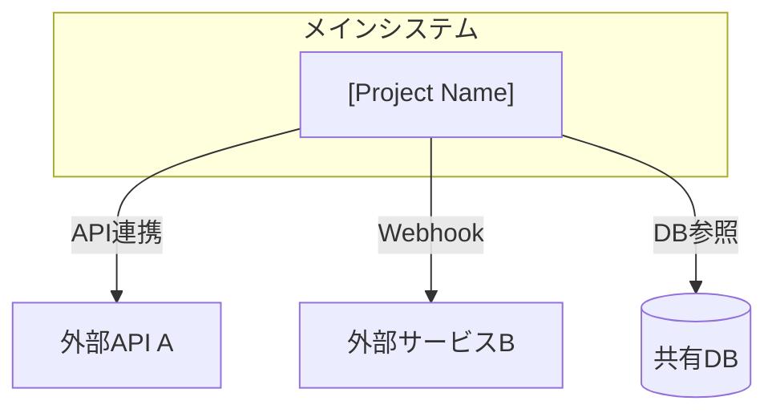

# システム関連図

## このファイルについて
メインシステムと関連する外部システム・サービスの全体像をまとめる。
関連システムが追加された場合は、このファイルの一覧を更新し、詳細は個別ファイルに記載する。

※ メインシステムの詳細は `doc/system/SYSTEM_OVERVIEW.md` を参照。

---

## システム関連図

※ 上記は記載例です。実際の連携に合わせて書き換えてください。

---

## 関連システム一覧

| No. | システム名 | 関連種別 | 概要 | 詳細ファイル | リポジトリURL |
|-----|-----------|---------|------|-------------|--------------|
| 1 | [システムA] | API連携 | [概要] | [SystemA.md](./SystemA.md) | [URL] |
| 2 | [システムB] | DB共有 | [概要] | [SystemB.md](./SystemB.md) | [URL] |

---

## 個別システムファイルの追加方法

関連システムが追加された場合：
1. `TEMPLATE.md` をコピーして `[SystemName].md` にリネーム
2. プレースホルダーを埋める
3. 上記「関連システム一覧」テーブルに行を追加する

テンプレート: [TEMPLATE.md](./TEMPLATE.md)

